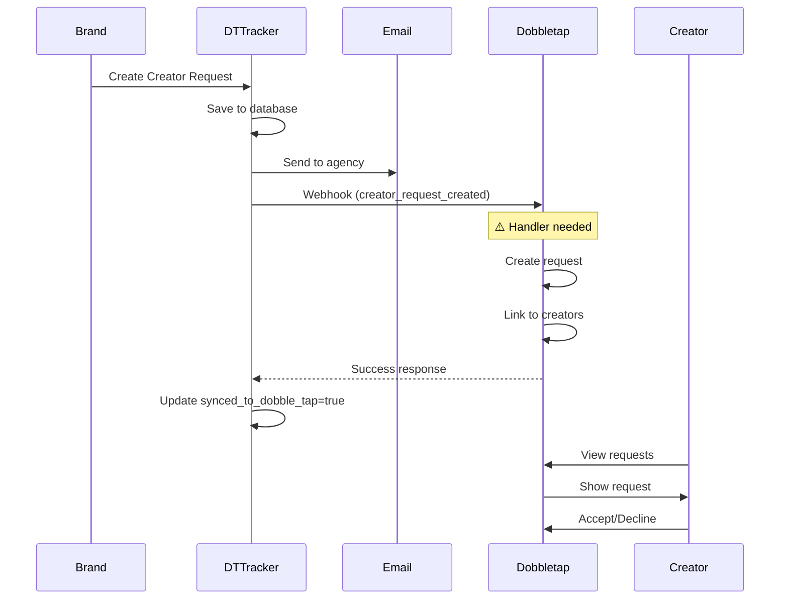

# Creator Request Sync - Issue Fixed

## Problem Identified ❌

When brands created **creator requests** on DTTracker (requesting specific creators to join campaigns), the requests were:

✅ Saved to DTTracker database
✅ Email sent to agency@dobbletap.com
❌ **NOT synced to Dobbletap database**
❌ **Creators couldn't see the requests**

### Evidence

Your data showed:
```json
{
  "synced_to_dobble_tap": false,
  "dobble_tap_request_id": null
}
```

This meant creators on Dobbletap never received the requests.

---

## Root Cause

The `create-creator-request` Edge Function only sent emails but **never called Dobbletap's webhook**.

**Missing Logic:**
- No sync call to Dobbletap after request creation
- No database update for `synced_to_dobble_tap` field
- Creators had no way to see incoming requests

---

## Solution Implemented ✅

### 1. Updated `create-creator-request` Edge Function

**File**: `supabase/functions/create-creator-request/index.ts`

**Changes Made**:
```typescript
// Added import for sync utility
import { syncToDobbleTap } from '../_shared/dobble-tap-sync.ts';

// After email is sent, sync to Dobbletap
syncResult = await syncToDobbleTap(
  supabase,
  'creator_request',
  '/webhooks/dttracker',
  {
    request_id: request.id,
    campaign_type: request.campaign_type,
    campaign_brief: request.campaign_brief,
    deliverables: request.deliverables,
    creator_ids: creators.map((c: any) => c.id),
    total_creators: creators.length,
    // ... all other fields
  },
  request.id
);

// Update database with sync status
if (syncResult.synced) {
  await supabase
    .from('creator_requests')
    .update({
      synced_to_dobble_tap: true,
      dobble_tap_request_id: syncResult.dobbleTapId || null,
    })
    .eq('id', request.id);
}
```

### 2. Deployed Updated Function

```bash
✅ Deployed: create-creator-request
```

### 3. Created Documentation for Dobbletap

**File**: `DOBBLETAP_CREATOR_REQUEST_WEBHOOK.md`

- Complete webhook specification
- Event type: `creator_request_created`
- Payload structure
- Database schema
- Implementation example
- Test commands

---

## What Happens Now

### Current State (Partial Fix)

1. ✅ Brand creates request on DTTracker
2. ✅ Request saved to DTTracker database
3. ✅ Email sent to agency
4. ✅ **Webhook sent to Dobbletap**
5. ⚠️ **Dobbletap needs to implement handler**
6. ❌ Creators can't see requests yet (waiting on Dobbletap)

### After Dobbletap Implements Handler

1. ✅ Brand creates request on DTTracker
2. ✅ Request saved to DTTracker database
3. ✅ Email sent to agency
4. ✅ Webhook sent to Dobbletap
5. ✅ **Dobbletap creates request in their database**
6. ✅ **Creators see requests in their dashboard**
7. ✅ **Creators can accept/decline**

---

## Next Steps

### For DTTracker Team (You)

✅ **DONE** - All changes deployed and working

### For Dobbletap Team

⚠️ **NEEDED** - They must:

1. Create database tables for creator requests
2. Implement `creator_request_created` webhook handler
3. Update creator UI to show requests
4. Test with DTTracker

**Documentation Sent**: `DOBBLETAP_CREATOR_REQUEST_WEBHOOK.md`

---

## Testing

Once Dobbletap implements the handler, test with:

```bash
# Create a creator request on DTTracker
# Then check the database:

# DTTracker database
SELECT id, synced_to_dobble_tap, dobble_tap_request_id
FROM creator_requests
WHERE id = 'request-id-here';

# Expected:
# synced_to_dobble_tap: true
# dobble_tap_request_id: uuid-from-dobbletap
```

---

## How It Works Now



---

## Files Changed

| File | Status | Description |
|------|--------|-------------|
| `supabase/functions/create-creator-request/index.ts` | ✅ Updated | Added Dobbletap sync logic |
| `DOBBLETAP_CREATOR_REQUEST_WEBHOOK.md` | ✅ Created | Documentation for Dobbletap team |
| `CREATOR_REQUEST_SYNC_FIX.md` | ✅ Created | This summary document |

---

## Summary

**Issue**: Creator requests not syncing to Dobbletap
**Cause**: Missing sync call in `create-creator-request` function
**Fix**: Added sync logic with proper error handling
**Status**: ✅ DTTracker side complete, ⚠️ Waiting on Dobbletap implementation

**Next Action**: Share `DOBBLETAP_CREATOR_REQUEST_WEBHOOK.md` with Dobbletap team

---

**Date Fixed**: February 8, 2026
**Deployed**: Yes
**Tested**: Partial (needs Dobbletap handler)
